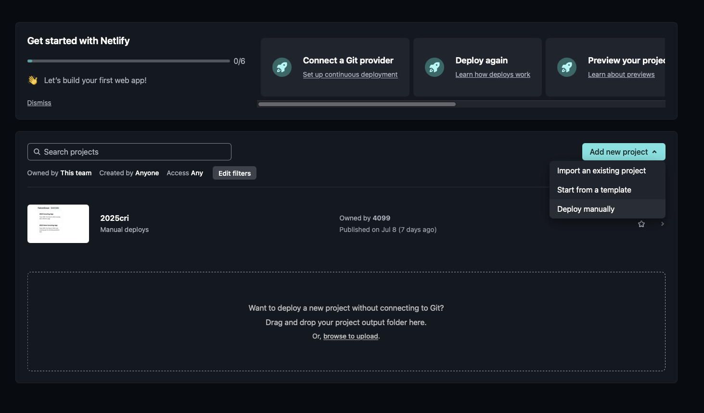

# FalconScout and FalconScoutCore Deployment

## FalconScout

Every competition, we send out a link that our members can use to scout with. We need to deploy our FalconScout app before the competition starts to send out new updates to the scouting app. Scouters need to also add this new deployment as a PWA to enable scouting without a stable internet connection.

1. Clone the repository and navigate to the app directory:
  ```bash
  git clone <repo_url>
  cd FalconScout/scoutingapp
  ```


2. Install dependencies and build the app:
  ```bash
  npm install
  npm run build
  ```
  This creates a `dist/` folder containing static files for deployment.  This is what you will use to paste into netlify.   
- Open [Netlify](https://app.netlify.com) and sign in.
- Press **Deploy manually** and paste in your `dist` folder.





- Change scouting app link to make it match our naming scheme. 


## FalconScoutCore

For FalconScoutCore, it’s not recommended to use a deployment to run it during competitions. It’s easier and recommended to just run the application locally with streamlit. Visit the [Quick Start](./QUICK_START.md) documentation for more information.
```bash
python -m streamlit run app.py
```

There is more stuff to setup with GitHub, however

-  To add your personal github access token, copy the `.env.example` in the `/falconscoutcore/` folder and rename your copy to `.env`. Add your github personal access token to this file. Make sure this token has permission to add files and commit to repositories.
   ```
   cp .env.example .env
   echo "GITHUB_KEY=<your key here>" > .env
   ```
-  Go into `config.json` and change the last few lines to match the current event.
   ```json
   "repo_config": {
     "repo": "team4099/ScoutingAppData",
     "update_json": "<EVT_CODE>_match_data.json",
     "update_qualitative_json": "<EVT_CODE>_qualitative_data.json"
   }
   ```
-  Go to our other repo, [team4099/ScoutingAppData](https://github.com/team4099/ScoutingAppData) and create the files that you just updated the names of.


