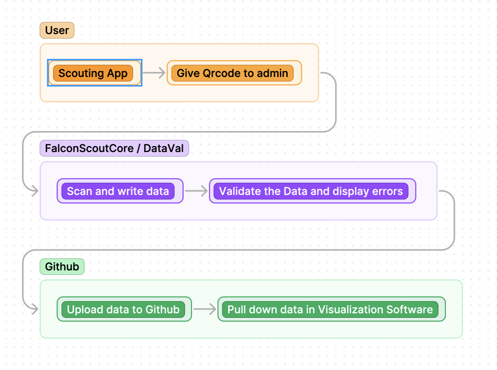

# What is FalconScout

## How does FalconScout Work

FalconScout is a data-pipeline tool to convert user generated data to json formatted data hosted on github. Steps are
1. **Scouting app**. PWA-based scouting app you can download on a phone. This app generates qrcodes which can be scanned.
2. **FalconScoutCore**. Core is a Flask app which runs on a computer with a camera and an internet connection.
3. **DataVal**. Data-val can read over the user data and find errors to alert the scouting admin with so they can correct the data.
4. **Github**. The data can be uploaded to a Github repo to be pulled from in data visualization tools




## After FalconScout

One of the great thigns about FalconScout is that the platform used for data visualization can be anything. You can use **[FalconVis](www.github.com/Team4099/FalconVis.git)** which is the online JSON-esque visualization tool we made at 4099. FalconVis pulls data from the Github Repository which is pushed on FalconScoutCore. This data is then used in an ApexChart's based graph system to visualize the data. Graphs can be made in close to 6 lines of code and can be edited on the user side.


You can also use **Tableau** or **Excel/Sheets**.

## View Data export format

**JSON**

The JSON file format is 
```
[
    {
        "scout_id": "Pranav",
        ...
        "team_num": 4099
    },
    ...
    {
        "scout_id": "Zac",
        ...
        "team_num": 4099
    },
]
```

**CSV**

The CSV file format is just the scan with a comma delimiter

Move onto the [tool setup guide](./TOOL_SETUP_GUIDE.md) page to install the necessary dependencies and languages for using FalconScout. If you feel you have all the tools, go to the [kinda quick start](./QUICK_START.md) to setup FalconScout